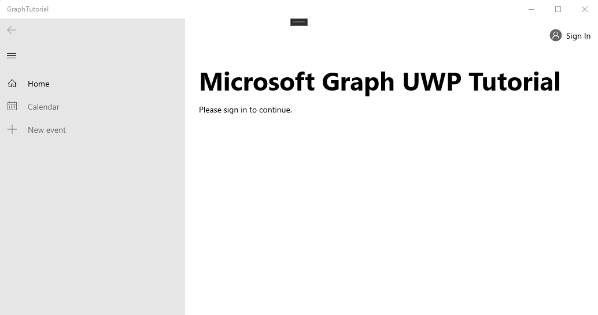

<!-- markdownlint-disable MD002 MD041 -->

Abra o Visual Studio e selecione **arquivo > novo > projeto**. Na caixa de diálogo **novo projeto** , faça o seguinte:

1. Selecione **modelos > Visual C# > Windows universal**.
1. Selecione **aplicativo em branco (Universal Windows)**.
1. Insira o **gráfico-tutorial** para o nome do projeto.


> [!IMPORTANT]
> Certifique-se de inserir exatamente o mesmo nome para o projeto do Visual Studio especificado nas instruções do laboratório. O nome do projeto do Visual Studio se torna parte do namespace no código. O código dentro dessas instruções depende do namespace correspondente ao nome do projeto do Visual Studio especificado nessas instruções. Se você usar um nome de projeto diferente, o código não será compilado, a menos que você ajuste todos os namespaces para corresponder ao nome do projeto do Visual Studio que você digitou ao criar o projeto.

Selecione **OK**. Na caixa de diálogo **novo projeto da plataforma universal do Windows** , verifique se a **versão mínima** está definida como `Windows 10 Fall Creators Update (10.0; Build 16299)` ou posterior e selecione **OK**.

Antes de prosseguir, instale alguns pacotes NuGet adicionais que serão usados posteriormente.

- [Microsoft. Toolkit. UWP. UI. Controls](https://www.nuget.org/packages/Microsoft.Toolkit.Uwp.Ui.Controls/) para adicionar alguns controles da interface do usuário para notificações no aplicativo e indicadores de carregamento.
- [Microsoft. Toolkit. UWP. UI. Controls. DataGrid](https://www.nuget.org/packages/Microsoft.Toolkit.Uwp.Ui.Controls.DataGrid/) para exibir as informações retornadas pelo Microsoft Graph.
- [Microsoft. Toolkit. UWP. UI. Controls. Graph](https://www.nuget.org/packages/Microsoft.Toolkit.Uwp.Ui.Controls.Graph/) para lidar com a recuperação de tokens de acesso e login.
- [Microsoft. Graph](https://www.nuget.org/packages/Microsoft.Graph/) para fazer chamadas para o Microsoft Graph.

Selecione **ferramentas > Gerenciador de pacotes do NuGet > console do Gerenciador de pacotes**. No console do Gerenciador de pacotes, insira os seguintes comandos.

```Powershell
Install-Package Microsoft.Toolkit.Uwp.Ui.Controls
Install-Package Microsoft.Toolkit.Uwp.Ui.Controls.DataGrid
Install-Package Microsoft.Toolkit.Uwp.Ui.Controls.Graph
Install-Package Microsoft.Graph
```

## <a name="design-the-app"></a>Projetar o aplicativo

Comece adicionando uma variável de nível de aplicativo para rastrear o estado de autenticação. No Gerenciador de soluções, expanda **app. XAML** e abra **app.XAML.cs**. Adicione a propriedade a seguir à `App` classe.

```cs
public bool IsAuthenticated { get; set; }
```

Em seguida, defina o layout da página principal. Abra `MainPage.xaml` e substitua todo o conteúdo pelo seguinte.

```xml
<Page
    x:Class="graph_tutorial.MainPage"
    xmlns="http://schemas.microsoft.com/winfx/2006/xaml/presentation"
    xmlns:x="http://schemas.microsoft.com/winfx/2006/xaml"
    xmlns:local="using:graph_tutorial"
    xmlns:d="http://schemas.microsoft.com/expression/blend/2008"
    xmlns:mc="http://schemas.openxmlformats.org/markup-compatibility/2006"
    xmlns:controls="using:Microsoft.Toolkit.Uwp.UI.Controls"
    xmlns:graphControls="using:Microsoft.Toolkit.Uwp.UI.Controls.Graph"
    mc:Ignorable="d"
    Background="{ThemeResource ApplicationPageBackgroundThemeBrush}">

    <Grid>
        <NavigationView x:Name="NavView"
            IsSettingsVisible="False"
            ItemInvoked="NavView_ItemInvoked">

            <NavigationView.Header>
                <graphControls:AadLogin x:Name="Login"
                    HorizontalAlignment="Left"
                    View="SmallProfilePhotoLeft"
                    AllowSignInAsDifferentUser="False"
                    />
            </NavigationView.Header>

            <NavigationView.MenuItems>
                <NavigationViewItem Content="Home" x:Name="Home" Tag="home">
                    <NavigationViewItem.Icon>
                        <FontIcon Glyph="&#xE10F;"/>
                    </NavigationViewItem.Icon>
                </NavigationViewItem>
                <NavigationViewItem Content="Calendar" x:Name="Calendar" Tag="calendar">
                    <NavigationViewItem.Icon>
                        <FontIcon Glyph="&#xE163;"/>
                    </NavigationViewItem.Icon>
                </NavigationViewItem>
            </NavigationView.MenuItems>

            <StackPanel>
                <controls:InAppNotification x:Name="Notification" ShowDismissButton="true" />
                <Frame x:Name="RootFrame" Margin="24, 0" />
            </StackPanel>
        </NavigationView>
    </Grid>
</Page>
```

Isso define um [NavigationView](https://docs.microsoft.com/uwp/api/windows.ui.xaml.controls.navigationview) básico com links de navegação de **calendário** e **Home** para atuar como o modo de exibição principal do aplicativo. Ele também adiciona um controle [AadLogin](https://docs.microsoft.com/dotnet/api/microsoft.toolkit.uwp.ui.controls.graph.aadlogin?view=win-comm-toolkit-dotnet-stable) no cabeçalho do modo de exibição. Esse controle permitirá que o usuário entre e saia. O controle ainda não está totalmente habilitado, você irá configurá-lo em um exercício posterior.

Agora, adicione outra página XAML para o modo de exibição de página inicial. Clique com o botão direito do mouse no projeto do **tutorial de gráfico** no Gerenciador de soluções e selecione **Adicionar > novo item...**. Escolha **página em branco**, `HomePage.xaml` digite no campo **nome** e selecione **Adicionar**. Adicione o código a seguir dentro `<Grid>` do elemento no arquivo.

```xml
<StackPanel>
    <TextBlock FontSize="44" FontWeight="Bold" Margin="0, 12">Microsoft Graph UWP Tutorial</TextBlock>
    <TextBlock x:Name="HomePageMessage">Please sign in to continue.</TextBlock>
</StackPanel>
```

Agora expanda **MainPage. XAML** no Gerenciador de soluções `MainPage.xaml.cs`e abra. Adicione o seguinte código ao `MainPage()` Construtor **após** a `this.InitializeComponent();` linha.

```cs
// Initialize auth state to false
SetAuthState(false);

// Navigate to HomePage.xaml
RootFrame.Navigate(typeof(HomePage));
```

Quando o aplicativo é iniciado pela primeira vez, ele inicializa o estado `false` de autenticação e navega até a Home Page.

Adicione a função a seguir à `MainPage` classe para gerenciar o estado de autenticação.

```cs
private void SetAuthState(bool isAuthenticated)
{
    (App.Current as App).IsAuthenticated = isAuthenticated;

    // Toggle controls that require auth
    Calendar.IsEnabled = isAuthenticated;
}
```

Adicione o manipulador de eventos a seguir para carregar a página solicitada quando o usuário seleciona um item do modo de exibição de navegação.

```cs
private void NavView_ItemInvoked(NavigationView sender, NavigationViewItemInvokedEventArgs args)
{
    var invokedItem = args.InvokedItem as string;

    switch (invokedItem.ToLower())
    {
        case "calendar":
            throw new NotImplementedException();
            break;
        case "home":
        default:
            RootFrame.Navigate(typeof(HomePage));
            break;
    }
}
```

Salve todas as suas alterações e, em seguida, pressione **F5** ou selecione **debug > iniciar a depuração** no Visual Studio.

> [!NOTE]
> Certifique-se de selecionar a configuração apropriada para seu computador (ARM, x64, x86).


