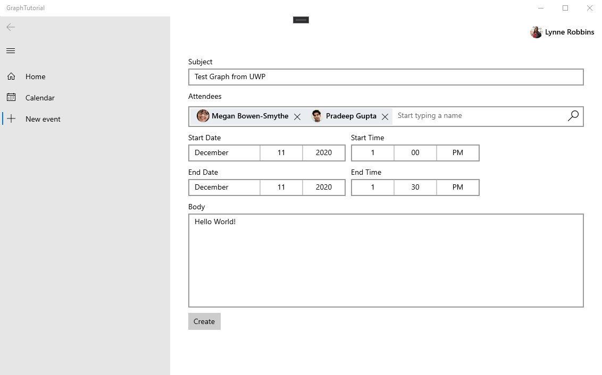

<!-- markdownlint-disable MD002 MD041 -->

Nesta seção, você adicionará a capacidade de criar eventos no calendário do usuário.

1. Adicione uma nova página para o novo modo de exibição de eventos. Clique com o botão direito do mouse no projeto **GraphTutorial** no Gerenciador de soluções e selecione **Adicionar > novo item...**. Escolha **página em branco**, digite `NewEventPage.xaml` no campo **nome** e selecione **Adicionar**.

1. Abra **NewEventPage. XAML** e substitua seu conteúdo pelo seguinte.

    :::code language="xaml" source="../demo/GraphTutorial/NewEventPage.xaml" id="NewEventPageXamlSnippet":::

1. Abra o **NewEventPage.XAML.cs** e adicione as seguintes `using` instruções à parte superior do arquivo.

    :::code language="csharp" source="../demo/GraphTutorial/NewEventPage.xaml.cs" id="UsingStatementsSnippet":::

1. Adicione a interface **INotifyPropertyChange** à classe **NewEventPage** . Substitua a declaração de classe existente pelo seguinte.

    ```csharp
    public sealed partial class NewEventPage : Page, INotifyPropertyChanged
    {
        public NewEventPage()
        {
            this.InitializeComponent();
            DataContext = this;
        }
    }
    ```

1. Adicione as propriedades a seguir à classe **NewEventPage** .

    :::code language="csharp" source="../demo/GraphTutorial/NewEventPage.xaml.cs" id="PropertiesSnippet":::

1. Adicione o código a seguir para obter o fuso horário do usuário do Microsoft Graph quando a página for carregada.

    :::code language="csharp" source="../demo/GraphTutorial/NewEventPage.xaml.cs" id="LoadTimeZoneSnippet":::

1. Adicione o código a seguir para criar o evento.

    :::code language="csharp" source="../demo/GraphTutorial/NewEventPage.xaml.cs" id="CreateEventSnippet":::

1. Modifique o `NavView_ItemInvoked` método no arquivo **MainPage.XAML.cs** para substituir a instrução existente `switch` pelo seguinte.

    ```csharp
    switch (invokedItem.ToLower())
    {
        case "new event":
            RootFrame.Navigate(typeof(NewEventPage));
            break;
        case "calendar":
            RootFrame.Navigate(typeof(CalendarPage));
            break;
        case "home":
        default:
            RootFrame.Navigate(typeof(HomePage));
            break;
    }
    ```

1. Salve suas alterações e execute o aplicativo. Entre, selecione o novo item de menu de **eventos** , preencha o formulário e selecione **criar** para adicionar um evento ao calendário do usuário.

    
