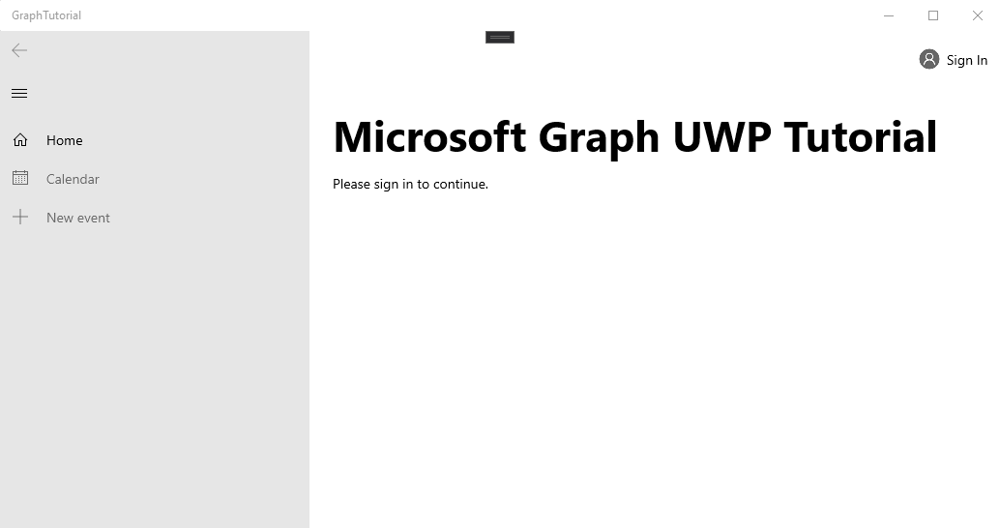

<!-- markdownlint-disable MD002 MD041 -->

<span data-ttu-id="5c3bd-101">Abra o Visual Studio e selecione **arquivo _GT_ novo projeto de >**.</span><span class="sxs-lookup"><span data-stu-id="5c3bd-101">Open Visual Studio, and select **File > New > Project**.</span></span> <span data-ttu-id="5c3bd-102">Na caixa de diálogo **novo projeto** , faça o seguinte:</span><span class="sxs-lookup"><span data-stu-id="5c3bd-102">In the **New Project** dialog, do the following:</span></span>

1. <span data-ttu-id="5c3bd-103">Selecione **modelos _GT_ Visual C# _GT_ Windows universal**.</span><span class="sxs-lookup"><span data-stu-id="5c3bd-103">Select **Templates > Visual C# > Windows Universal**.</span></span>
1. <span data-ttu-id="5c3bd-104">Selecione **aplicativo em branco (Universal Windows)**.</span><span class="sxs-lookup"><span data-stu-id="5c3bd-104">Select **Blank App (Universal Windows)**.</span></span>
1. <span data-ttu-id="5c3bd-105">Insira o **gráfico-tutorial** para o nome do projeto.</span><span class="sxs-lookup"><span data-stu-id="5c3bd-105">Enter **graph-tutorial** for the Name of the project.</span></span>


> [!IMPORTANT]
> <span data-ttu-id="5c3bd-107">Certifique-se de inserir exatamente o mesmo nome para o projeto do Visual Studio especificado nas instruções do laboratório.</span><span class="sxs-lookup"><span data-stu-id="5c3bd-107">Ensure that you enter the exact same name for the Visual Studio Project that is specified in these lab instructions.</span></span> <span data-ttu-id="5c3bd-108">O nome do projeto do Visual Studio se torna parte do namespace no código.</span><span class="sxs-lookup"><span data-stu-id="5c3bd-108">The Visual Studio Project name becomes part of the namespace in the code.</span></span> <span data-ttu-id="5c3bd-109">O código dentro dessas instruções depende do namespace correspondente ao nome do projeto do Visual Studio especificado nessas instruções.</span><span class="sxs-lookup"><span data-stu-id="5c3bd-109">The code inside these instructions depends on the namespace matching the Visual Studio Project name specified in these instructions.</span></span> <span data-ttu-id="5c3bd-110">Se você usar um nome de projeto diferente, o código não será compilado, a menos que você ajuste todos os namespaces para corresponder ao nome do projeto do Visual Studio que você digitou ao criar o projeto.</span><span class="sxs-lookup"><span data-stu-id="5c3bd-110">If you use a different project name the code will not compile unless you adjust all the namespaces to match the Visual Studio Project name you enter when you create the project.</span></span>

<span data-ttu-id="5c3bd-111">Selecione **OK**.</span><span class="sxs-lookup"><span data-stu-id="5c3bd-111">Select **OK**.</span></span> <span data-ttu-id="5c3bd-112">Na caixa de diálogo **novo projeto da plataforma universal do Windows** , verifique se a **versão mínima** está definida como `Windows 10 Fall Creators Update (10.0; Build 16299)` ou posterior e selecione **OK**.</span><span class="sxs-lookup"><span data-stu-id="5c3bd-112">In the **New Universal Windows Platform Project** dialog, ensure that the **Minimum version** is set to `Windows 10 Fall Creators Update (10.0; Build 16299)` or later and select **OK**.</span></span>

<span data-ttu-id="5c3bd-113">Antes de prosseguir, instale alguns pacotes NuGet adicionais que serão usados posteriormente.</span><span class="sxs-lookup"><span data-stu-id="5c3bd-113">Before moving on, install some additional NuGet packages that you will use later.</span></span>

- <span data-ttu-id="5c3bd-114">[Microsoft. Toolkit. UWP. UI. Controls](https://www.nuget.org/packages/Microsoft.Toolkit.Uwp.Ui.Controls/) para adicionar alguns controles da interface do usuário para notificações no aplicativo e indicadores de carregamento.</span><span class="sxs-lookup"><span data-stu-id="5c3bd-114">[Microsoft.Toolkit.Uwp.Ui.Controls](https://www.nuget.org/packages/Microsoft.Toolkit.Uwp.Ui.Controls/) to add some UI controls for in-app notifications and loading indicators.</span></span>
- <span data-ttu-id="5c3bd-115">[Microsoft. Toolkit. UWP. UI. Controls. DataGrid](https://www.nuget.org/packages/Microsoft.Toolkit.Uwp.Ui.Controls.DataGrid/) para exibir as informações retornadas pelo Microsoft Graph.</span><span class="sxs-lookup"><span data-stu-id="5c3bd-115">[Microsoft.Toolkit.Uwp.Ui.Controls.DataGrid](https://www.nuget.org/packages/Microsoft.Toolkit.Uwp.Ui.Controls.DataGrid/) to display the information returned by Microsoft Graph.</span></span>
- <span data-ttu-id="5c3bd-116">[Microsoft. Toolkit. UWP. UI. Controls. Graph](https://www.nuget.org/packages/Microsoft.Toolkit.Uwp.Ui.Controls.Graph/) para lidar com a recuperação de tokens de acesso e login.</span><span class="sxs-lookup"><span data-stu-id="5c3bd-116">[Microsoft.Toolkit.Uwp.Ui.Controls.Graph](https://www.nuget.org/packages/Microsoft.Toolkit.Uwp.Ui.Controls.Graph/) to handle login and access token retrieval.</span></span>
- <span data-ttu-id="5c3bd-117">[Microsoft. Graph](https://www.nuget.org/packages/Microsoft.Graph/) para fazer chamadas para o Microsoft Graph.</span><span class="sxs-lookup"><span data-stu-id="5c3bd-117">[Microsoft.Graph](https://www.nuget.org/packages/Microsoft.Graph/) for making calls to the Microsoft Graph.</span></span>

<span data-ttu-id="5c3bd-118">Selecione **ferramentas _GT_ Gerenciador de pacotes do NuGet _GT_ console do Gerenciador de pacotes**.</span><span class="sxs-lookup"><span data-stu-id="5c3bd-118">Select **Tools > NuGet Package Manager > Package Manager Console**.</span></span> <span data-ttu-id="5c3bd-119">No console do Gerenciador de pacotes, insira os seguintes comandos.</span><span class="sxs-lookup"><span data-stu-id="5c3bd-119">In the Package Manager Console, enter the following commands.</span></span>

```Powershell
Install-Package Microsoft.Toolkit.Uwp.Ui.Controls
Install-Package Microsoft.Toolkit.Uwp.Ui.Controls.DataGrid
Install-Package Microsoft.Toolkit.Uwp.Ui.Controls.Graph
Install-Package Microsoft.Graph
```

## <a name="design-the-app"></a><span data-ttu-id="5c3bd-120">Projetar o aplicativo</span><span class="sxs-lookup"><span data-stu-id="5c3bd-120">Design the app</span></span>

<span data-ttu-id="5c3bd-121">Comece adicionando uma variável de nível de aplicativo para rastrear o estado de autenticação.</span><span class="sxs-lookup"><span data-stu-id="5c3bd-121">Start by adding an application-level variable to track authentication state.</span></span> <span data-ttu-id="5c3bd-122">No Gerenciador de soluções, expanda **app. XAML** e abra **app.XAML.cs**.</span><span class="sxs-lookup"><span data-stu-id="5c3bd-122">In Solution Explorer, expand **App.xaml** and open **App.xaml.cs**.</span></span> <span data-ttu-id="5c3bd-123">Adicione a propriedade a seguir à `App` classe.</span><span class="sxs-lookup"><span data-stu-id="5c3bd-123">Add the following property to the `App` class.</span></span>

```cs
public bool IsAuthenticated { get; set; }
```

<span data-ttu-id="5c3bd-124">Em seguida, defina o layout da página principal.</span><span class="sxs-lookup"><span data-stu-id="5c3bd-124">Next, define the layout for the main page.</span></span> <span data-ttu-id="5c3bd-125">Abra `MainPage.xaml` e substitua todo o conteúdo pelo seguinte.</span><span class="sxs-lookup"><span data-stu-id="5c3bd-125">Open `MainPage.xaml` and replace its entire contents with the following.</span></span>

```xml
<Page
    x:Class="graph_tutorial.MainPage"
    xmlns="http://schemas.microsoft.com/winfx/2006/xaml/presentation"
    xmlns:x="http://schemas.microsoft.com/winfx/2006/xaml"
    xmlns:local="using:graph_tutorial"
    xmlns:d="http://schemas.microsoft.com/expression/blend/2008"
    xmlns:mc="http://schemas.openxmlformats.org/markup-compatibility/2006"
    xmlns:controls="using:Microsoft.Toolkit.Uwp.UI.Controls"
    xmlns:graphControls="using:Microsoft.Toolkit.Uwp.UI.Controls.Graph"
    mc:Ignorable="d"
    Background="{ThemeResource ApplicationPageBackgroundThemeBrush}">

    <Grid>
        <NavigationView x:Name="NavView"
            IsSettingsVisible="False"
            ItemInvoked="NavView_ItemInvoked">

            <NavigationView.Header>
                <graphControls:AadLogin x:Name="Login"
                    HorizontalAlignment="Left"
                    View="SmallProfilePhotoLeft"
                    AllowSignInAsDifferentUser="False"
                    />
            </NavigationView.Header>

            <NavigationView.MenuItems>
                <NavigationViewItem Content="Home" x:Name="Home" Tag="home">
                    <NavigationViewItem.Icon>
                        <FontIcon Glyph="&#xE10F;"/>
                    </NavigationViewItem.Icon>
                </NavigationViewItem>
                <NavigationViewItem Content="Calendar" x:Name="Calendar" Tag="calendar">
                    <NavigationViewItem.Icon>
                        <FontIcon Glyph="&#xE163;"/>
                    </NavigationViewItem.Icon>
                </NavigationViewItem>
            </NavigationView.MenuItems>

            <StackPanel>
                <controls:InAppNotification x:Name="Notification" ShowDismissButton="true" />
                <Frame x:Name="RootFrame" Margin="24, 0" />
            </StackPanel>
        </NavigationView>
    </Grid>
</Page>
```

<span data-ttu-id="5c3bd-126">Isso define um [NavigationView](https://docs.microsoft.com/uwp/api/windows.ui.xaml.controls.navigationview) básico com links de navegação de **calendário** e **Home** para atuar como o modo de exibição principal do aplicativo.</span><span class="sxs-lookup"><span data-stu-id="5c3bd-126">This defines a basic [NavigationView](https://docs.microsoft.com/uwp/api/windows.ui.xaml.controls.navigationview) with **Home** and **Calendar** navigation links to act as the main view of the app.</span></span> <span data-ttu-id="5c3bd-127">Ele também adiciona um controle [AadLogin](https://docs.microsoft.com/dotnet/api/microsoft.toolkit.uwp.ui.controls.graph.aadlogin?view=win-comm-toolkit-dotnet-stable) no cabeçalho do modo de exibição.</span><span class="sxs-lookup"><span data-stu-id="5c3bd-127">It also adds an [AadLogin](https://docs.microsoft.com/dotnet/api/microsoft.toolkit.uwp.ui.controls.graph.aadlogin?view=win-comm-toolkit-dotnet-stable) control in the header of the view.</span></span> <span data-ttu-id="5c3bd-128">Esse controle permitirá que o usuário entre e saia. O controle ainda não está totalmente habilitado, você irá configurá-lo em um exercício posterior.</span><span class="sxs-lookup"><span data-stu-id="5c3bd-128">That control will allow the user to sign in and out. The control isn't fully enabled yet, you will configure it in a later exercise.</span></span>

<span data-ttu-id="5c3bd-129">Agora, adicione outra página XAML para o modo de exibição de página inicial.</span><span class="sxs-lookup"><span data-stu-id="5c3bd-129">Now add another XAML page for the Home view.</span></span> <span data-ttu-id="5c3bd-130">Clique com o botão direito do mouse no projeto do **tutorial de gráfico** no Gerenciador de soluções e escolha **Adicionar > novo item...**. Escolha **página em branco**, `HomePage.xaml` digite no campo **nome** e escolha **Adicionar**.</span><span class="sxs-lookup"><span data-stu-id="5c3bd-130">Right-click the **graph-tutorial** project in Solution Explorer and choose **Add > New Item...**. Choose **Blank Page**, enter `HomePage.xaml` in the **Name** field, and choose **Add**.</span></span> <span data-ttu-id="5c3bd-131">Adicione o código a seguir dentro `<Grid>` do elemento no arquivo.</span><span class="sxs-lookup"><span data-stu-id="5c3bd-131">Add the following code inside the `<Grid>` element in the file.</span></span>

```xml
<StackPanel>
    <TextBlock FontSize="44" FontWeight="Bold" Margin="0, 12">Microsoft Graph UWP Tutorial</TextBlock>
    <TextBlock x:Name="HomePageMessage">Please sign in to continue.</TextBlock>
</StackPanel>
```

<span data-ttu-id="5c3bd-132">Agora expanda **MainPage. XAML** no Gerenciador de soluções `MainPage.xaml.cs`e abra.</span><span class="sxs-lookup"><span data-stu-id="5c3bd-132">Now expand **MainPage.xaml** in Solution Explorer and open `MainPage.xaml.cs`.</span></span> <span data-ttu-id="5c3bd-133">Adicione o seguinte código ao `MainPage()` Construtor **após** a `this.InitializeComponent();` linha.</span><span class="sxs-lookup"><span data-stu-id="5c3bd-133">Add the following code to the `MainPage()` constructor **after** the `this.InitializeComponent();` line.</span></span>

```cs
// Initialize auth state to false
SetAuthState(false);

// Navigate to HomePage.xaml
RootFrame.Navigate(typeof(HomePage));
```

<span data-ttu-id="5c3bd-134">Quando o aplicativo é iniciado pela primeira vez, ele inicializa o estado `false` de autenticação e navega até a Home Page.</span><span class="sxs-lookup"><span data-stu-id="5c3bd-134">When the app first starts, it will initialize the authentication state to `false` and navigate to the home page.</span></span>

<span data-ttu-id="5c3bd-135">Adicione a função a seguir à `MainPage` classe para gerenciar o estado de autenticação.</span><span class="sxs-lookup"><span data-stu-id="5c3bd-135">Add the following function to the `MainPage` class to manage authentication state.</span></span>

```cs
private void SetAuthState(bool isAuthenticated)
{
    (App.Current as App).IsAuthenticated = isAuthenticated;

    // Toggle controls that require auth
    Calendar.IsEnabled = isAuthenticated;
}
```

<span data-ttu-id="5c3bd-136">Adicione o manipulador de eventos a seguir para carregar a página solicitada quando o usuário seleciona um item do modo de exibição de navegação.</span><span class="sxs-lookup"><span data-stu-id="5c3bd-136">Add the following event handler to load the requested page when the user selects an item from the navigation view.</span></span>

```cs
private void NavView_ItemInvoked(NavigationView sender, NavigationViewItemInvokedEventArgs args)
{
    var invokedItem = args.InvokedItem as string;

    switch (invokedItem.ToLower())
    {
        case "calendar":
            throw new NotImplementedException();
            break;
        case "home":
        default:
            RootFrame.Navigate(typeof(HomePage));
            break;
    }
}
```

<span data-ttu-id="5c3bd-137">Salve todas as suas alterações e, em seguida, pressione **F5** ou selecione **debug _GT_ iniciar a depuração** no Visual Studio.</span><span class="sxs-lookup"><span data-stu-id="5c3bd-137">Save all of your changes, then press **F5** or select **Debug > Start Debugging** in Visual Studio.</span></span>

> [!NOTE]
> <span data-ttu-id="5c3bd-138">Certifique-se de selecionar a configuração apropriada para seu computador (ARM, x64, x86).</span><span class="sxs-lookup"><span data-stu-id="5c3bd-138">Make sure you select the appropriate configuration for your machine (ARM, x64, x86).</span></span>


